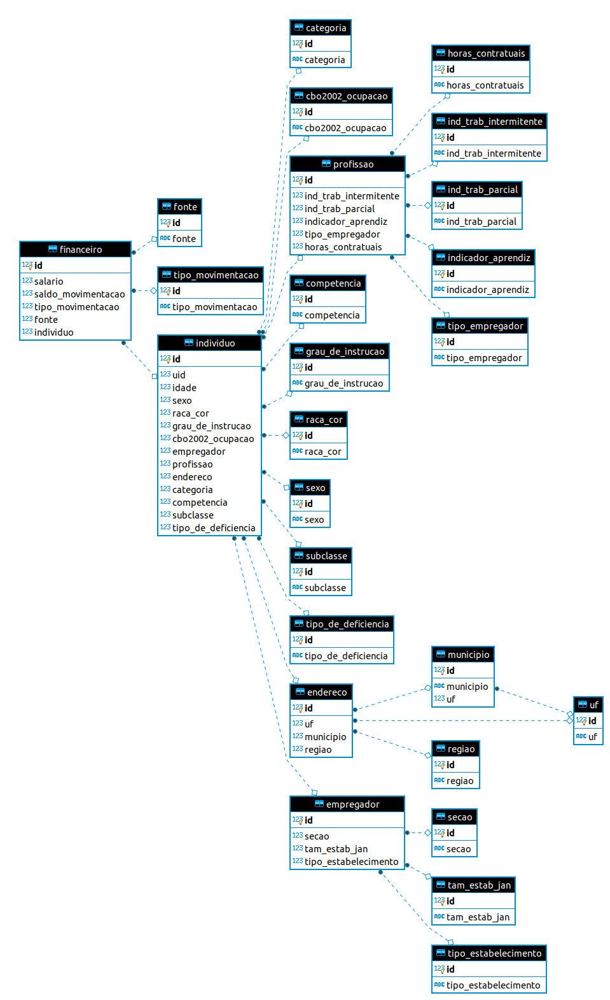

# Desafio QueroEducação: Engenheiro de Dados

Por Eduardo S. Pereira

## Case:

*DATA ENGINEER*

Disponibilizamos alguns dados públicos em uma API, seu desafio é fazer a exportação, transformação e carregamento desses dados em um banco de dados, a tabela final deve estar com o schema estruturado conforme as boas práticas.
Seguem alguns passos para facilitar o seu desenvolvimento:
Criar o script de coleta dos dados (se atentar aos tratamentos de erros)
Tratar os dados que foram coletados
Criar o banco relacional na sua máquina com a tabela para receber os dados
Inserir os dados tratados na tabela criada
Criar índices na tabela para facilitar a consulta
Endereço: http://dataeng.quero.com:5000/caged-data
Observação: O script pode ser feito em qualquer linguagem (de preferência Python) e em qualquer banco relacional (de preferência PostgreSQL)

## Solução

Para a coleta dos dados foi utilizado a biblioteca requests juntamente con Pandas.
Os elementos categóricos foram mapeados, fazendo uma reeducação de elementos comuns a um conjunto
Reduzido de informções.

Para o banco de dados foi utilizado uma Camada de Abstração de Banco de Dados -
pyDAL. As tabelas foram construídas programáticamente em Python, permitindo a integração com um grupo maior de banco de dados.
Os dados foram injetados num banco de dados PostgreSQL.
Abaixo está o diagrama de entidade relacionamento para o banco gerado.

